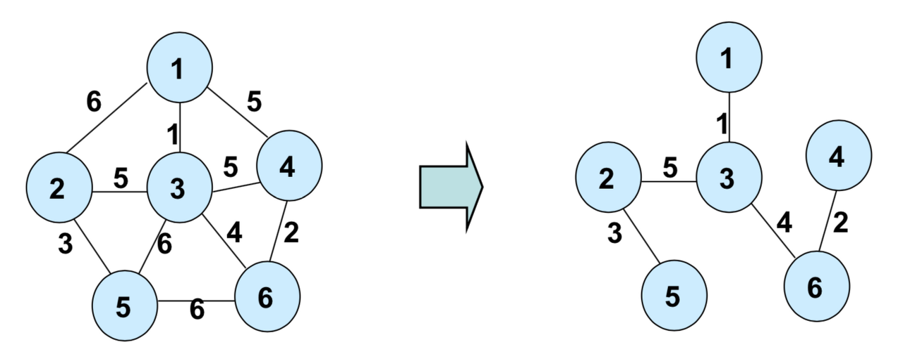

# 17th_study

### 17주차 알고리즘스터디

# 지난주 문제

<details>
<summary>접기/펼치기</summary>
<div markdown="1">

## [병원거리 최소화하기](https://www.codetree.ai/training-field/frequent-problems/problems/min-of-hospital-distance/submissions?page=3&pageSize=20)

### [민웅](<./병원거리 최소화하기/민웅.py>)

```py
import sys
from itertools import combinations
input = sys.stdin.readline

n, m = map(int, input().split().strip())
field = [list(map(int, input().split())) for _ in range(n)]
tmp_field = [[0 for _ in range(n)] for _ in range(n)]

hos = 0
hos_cord = []
peo_cord = []
ans = float('inf')

for i in range(n):
    for j in range(n):
        if field[i][j] == 2:
            hos += 1
            hos_cord.append([i, j])
        elif field[i][j] == 1:
            tmp_field[i][j] = 1
            peo_cord.append([i, j])

num_lst = [i for i in range(hos)]
comb = combinations(num_lst, m)
for c in comb:
    tmp_hos = []
    for v in c:
        tmp_hos.append(hos_cord[v])
    tmp_ans = 0
    for p in peo_cord:
        dis = float('inf')
        for th in tmp_hos:
            dis = min(dis, abs(th[0] - p[0]) + abs(th[1] - p[1]))
        tmp_ans += dis
        if tmp_ans > ans:
            break
    else:
        ans = tmp_ans
print(ans)

```

### [상미](<./병원거리 최소화하기/상미.py>)

```py

```

### [병국](<./병원거리 최소화하기/병국.py>)

```py

```

### [성구](./병원거리%20최소화하기/성구.py)

```py
import sys
from itertools import combinations
input = sys.stdin.readline

def distance(x1:int, y1:int, x2:int, y2:int) -> int:
    return abs(x2-x1) + abs(y2-y1)


def solution(n:int, m:int, field:list):
    hospital = []
    person = []

    for i in range(n):
        for j in range(n):
            if field[i][j] == 2:
                hospital.append((i,j))
            elif field[i][j] == 1:
                person.append((i,j))
    # 후보군 선정
    cons = list(combinations(range(len(hospital)), m))
    h_dist = [0] * len(cons)
    for i in range(len(cons)):
        # 사람 별 가까운 병원 거리 저장
        p_dist = [1000000] * len(person)
        for idx in cons[i]:
            for p in range(len(person)):
                p_dist[p] = min(p_dist[p], distance(hospital[idx][1], hospital[idx][0], person[p][1], person[p][0]))
        # m 개의 병원에서 가장 가까운 사람 수를 모두 더해 저장
        h_dist[i] = sum(p_dist)
    return min(h_dist)


if __name__ == "__main__":
    n, m = map(int, input().split())
    field = [list(map(int, input().split())) for _ in range(n)]
    ans = solution(n, m, field)
    print(ans)
```

<br/><br/>

## [Z](https://www.acmicpc.net/problem/1074)

### [민웅](./Z/민웅.py)

```py

```

### [상미](./Z/상미.py)

```py
## 백준 1074_ Z

import sys
input = sys.stdin.readline

def solve(n, r, c):
    if n == 0:
        return 0

    half = 2 ** (n-1)
    quad = 0

    if r >= half:
        quad += 2   # 행은 다음 행으로 갈 때 사분할 2번 지나감
        r -= half

    if c >= half:
        quad += 1
        c -= half   # 열은 다음 열로 갈 때 사분할 1번 지나감

    return quad * half * half + solve(n-1, r, c)


N, r, c = map(int, input().split())
result = solve(N, r, c)
print(result)


```

### [병국](./Z/병국.py)

```py

```

### [성구](./Z/성구.py)

```py
# 1074 Z
import sys
sys.setrecursionlimit(10**6)
input = sys.stdin.readline

def z(n:int, r:int, c:int) -> int:
    if n == 1:
        return 0
    half = n // 2
    seq = 0
    if r >= half:
        seq += 2
        r -= half

    if c >= half:
        seq += 1
        c -= half


    return seq * half * half + z(half, r, c)

if __name__ == "__main__":
    N, r, c = map(int, input().split())
    cnt = z(2**N, r, c)
    print(cnt)
```

</div>
</details>

</br></br></br>

# 이번주 문제

<details open>
<summary>접기/펼치기</summary>
<div markdown="1">

## [네트워크 연결](https://www.acmicpc.net/problem/1922)

### [민웅](<./네트워크 연결/민웅.py>)

```py
# 1922_네트워크연결_network-connecting
import sys
input = sys.stdin.readline
# 4 2 6 3 8

def findset(node):
    while parent[node] != node:
        node = parent[node]
    return node


def union(x, y):
    parent[findset(y)] = findset(x)


N = int(input().strip())
M = int(input().strip())

graph = []
parent = [i for i in range(N+1)]
for _ in range(M):
    s, g, w = map(int, input().split())
    graph.append([s, g, w])

graph.sort(key=lambda x: x[2])

cost = 0
cnt = 0
for g in graph:
    u, v, w = g
    if findset(u) != findset(v):
        cnt += 1
        cost += w
        union(u, v)
        if cnt == N:
            break

# print(parent)
print(cost)
```

### [상미](<./네트워크 연결/상미.py>)

```py
## 백준 1922 _ 네트워크 연결
## 답 안 나옴

import sys
input = sys.stdin.readline

N = int(input())
M = int(input())
arr = [[0] * (N+1) for _ in range(N+1)]
for _ in range(M):
    a, b, c = map(int, input().split())
    arr[a][b] = c
    arr[b][a] = c
visited = [0] * (N+1)
minC = 100000000

def sol(arr, tmp, cost):
    visited[tmp] = 1    # 방문 처리
    if visited == [1] * (N+1):  # 모두 다 방문했으면
        if minC > cost:
            minC = cost
        return
    for i in range(N+1):    # 연결되어 있고 방문 안 한 곳이라면
        if arr[tmp][i] and not visited[i]:
            sol(arr, i, cost + arr[tmp][i]) # 방문
        else:
            return

print(sol(arr, 1, 0))
print(minC)
```

### [병국](<./네트워크 연결/병국.py>)

```py

```

### [성구](<./네트워크 연결/성구.py>)

```py
# 1922 네트워크 연결
import sys
input = sys.stdin.readline

# MST (Ksruskal Algorithm)
# root 찾는 알고리즘(parent 배열 이용)
def find(num:int) -> int:
    # 부모 노드가 나, 나 자신이 root 이면 멈춤
    # 반복문
    tmp = num
    # parent 배열을 통해 상위 노드를 찾아서 저장
    while parent[tmp] != tmp:
        tmp = parent[tmp]
        parent[num] = tmp

    return parent[num]
    # 재귀
    # if parent[num] == num:
    #     return num
    # parent[num] = find(parent[num])
    # return parent[num]

# 두 spot을 이어줌
def union(num1:int, num2:int) -> None:
    # 두 root를 찾아서
    x = find(num1)
    y = find(num2)
    # 순환되지 않는다면 하나의 고리로 이어줌
    if x != y:
        parent[y] = x
    return


def kruskal():
    # Kruskal 알고리즘 == 최소 신장트리
    node = []      # 지나온 노드 저장용
    cost = 0       # 비용 저장
    for i in range(M):
        c, a, b = network[i]        # 비용이 가장 적은 노드부터 가져옴
        if find(a) == find(b):      # 순환되면 패스
            continue
        node.append(i)              # 지나온 노드는 저장
        union(a, b)                 # 지나갈 수 있다 == 이어져있다
        cost += c                   # 비용 저장
        if len(node) == N-1:        # 모든 노드 다 탐색했으면 비용 return -> 최소 비용임
            return cost
    return cost


if __name__ == "__main__":
    N = int(input())
    M = int(input())
    network = []
    for _ in range(M):
        a, b, c = map(int, input().split())
        if a != b:      # 같을 때는 최소가 되지 않기에(c>=1) 빼줌
            network.append((c, a, b))
    # root를 저장할 parent 배열
    parent = [i for i in range(N+1)]
    # 비용순으로 정렬
    network.sort(key=lambda x:x[0])
    ans = kruskal()
    print(ans)
```

</div>
</details>
<br><br>

# 알고리즘 설명

<details>
<summary>접기/펼치기</summary>

## 용어 정리

### Spanning Tree (신장 트리)

- **정의**: 주어진 그래프의 모든 정점을 포함하면서 사이클이 없는 부분 그래프.
- **중요성**: 신장 트리를 통해 그래프의 구조를 단순화시키고, 필요한 정보만을 추출하기 위함
- **속성**:
  - 원래 그래프의 모든 정점을 포함해야한다.
  - 정확히 (정점 수 - 1)개의 간선을 가져야한다.
  - 사이클을 형성하지 않는다.

### Minimum Spanning Tree (최소 신장 트리)



- **정의**: 가능한 신장 트리(Spanning Tree) 중에서 간선의 가중치 합이 최소인 신장 트리.
- **중요성**: 최소 비용 문제를 해결하는 데 사용되며 주로 **네트워크 설계**, **도로 건설**, **전력망 구축** 등 다양한 분야에서 응용가능
- **대표알고리즘 예**: [Kruskal 알고리즘](#Kruskal-알고리즘), [Prim 알고리즘](#prim-알고리즘).
- **속성**:
  - 모든 정점을 포함하면서 최소한의 비용으로 연결합니다.
  - 가중치가 가장 낮은 간선부터 선택하여 구성한다.(그리디 방법).

## 대표 알고리즘

### Kruskal 알고리즘

- **탐색 방법**: 가장 가벼운 가중치의 간선부터 선택하여 MST를 찾는 알고리즘.
- **구현 방법**
  1. 간선 정렬 및 정점 초기화
  2. 간선 선택 후 정점 병합
  3. n-1개의 간선이 선택될 때까지(모든 정점이 선택될 때까지) 2번단계 반복

```py
# 구현

# 주어진 노드의 루트노드 반환
# 부모노드를 찾아가며, 루트노드(자기 자신을 가리키고있는 노드)를 찾음
def findset(node):
    while parent[node] != node:
        node = parent[node]
    return node

# x, y 노드를 같은 그룹으로 병합
def union(x, y):
    parent[findset(y)] = findset(x)

def kruskal(graph, V):
    # 그래프의 간선을 가중치에 따라 오름차순으로 정렬
    graph.sort(key=lambda x: x[2])

    # 각 정점에 대한 부모 초기화
    parent = [i for i in range(V+1)]

    mst = []
    total_cost = 0

    for edge in graph:
        u, v, weight = edge
        # 사이클이 형성되지 않는 경우에만 간선 선택
        if findset(u) != findset(v):
            union(u, v)
            mst.append(edge)
            total_cost += weight

    return mst, total_cost

graph = []
for _ in range(M):
    s, g, w = map(int, input().split())
    graph.append([s, g, w])

kruskal(graph, V)

```

### Prim 알고리즘

- **탐색 방법**: 시작 정점에서부터 점차 그래프를 확장해 나가며 MST를 찾는 알고리즘.
- **구현 방법**
  1. 임의의 시작정점 선택 후 간선그룹 생성(heapq)
  2. 간선 선택 - MST 집합에 속한 정점과 속하지 않은 정점을 연결하는 간선 중 최소가중치 간선을 선택함.
  3. 추가된 정점에 연결된 새로운 간선 추가 및 2번 과정 반복
  4. 큐가 비거나 모든정점이 MST에 포함되면 종료

```py
# 구현
import heapq

def prim(graph, start, V):
    visited = [0] * (V+1)
    min_heap = [(0, start)]  # (가중치, 정점)
    total_cost = 0

    while min_heap:
        weight, u = heapq.heappop(min_heap)
        if not visited[u]:
            visited[u] = 1
            total_cost += weight
            for v, w in graph[u]:
                if not visited[v]:
                    heapq.heappush(min_heap, (w, v))

    return total_cost

graph = [[] for _ in range(V+1)]
# 그래프에 정점 별 간선정보 (u, v, w) 추가
cost = prim(graph, 1, V)

```

## Kruskal vs Prim (https://8iggy.tistory.com/160)

- 희소 그래프: 정점들 사이에 간선이 상대적으로 적게 존재하는 그래프. 예를 들어, 정점의 수에 비해 간선의 수가 훨씬 적은 경우.

- 밀집 그래프: 정점들 사이에 많은 수의 간선이 존재하는 그래프. 거의 모든 정점 쌍 사이에 간선이 존재하는 경우.

### Kruskal

-> 간선의 수가 적은 희소 그래프에 적합. 연결 요소 파악에 유용.

장점:

- 구현이 간단하고 메모리 사용이 효율적.
- 간선의 수가 적을수록 더 효과적.

단점:

- 간선의 수가 많은 밀집 그래프에서는 비효율적.
- 모든 간선을 정렬해야 하므로 초기에 시간이 소요됨.

### Prim

-> 간선의 수가 많은 밀집 그래프에 적합. 작은 그래프에서 빠른 성능.

장점:

- 밀집 그래프에서 효율적.
- 최소 힙을 사용하여 동적으로 간선 선택 가능.

단점:

- 메모리 사용량이 더 많음.
- 정점의 수가 많을수록 성능 저하 가능성 있음.

</details>
